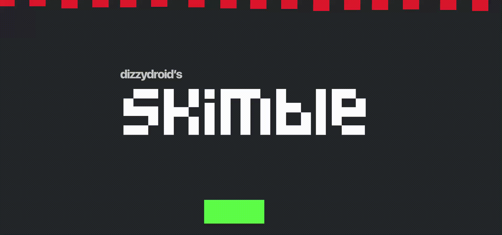

# 𝚜𝚔𝚒𝚖𝚋𝚕𝚎

 

<pre align = "center"> <b> 
<a href="https://dizzydroid.github.io/skimble/">GO SKIMBLE!</a> </b>
</pre>

In this simple Phaser®-Built arcade-style game, you're that green fella dodging falling red fellas from the sky! 
As the game progresses, the red fellas get bigger and faster 0_0! 

How long can you skimble?

______________________________________
### Known issues: 
- ~~Loading the game could take about 2-4 seconds, i'm working on optimizing that~~
- ~~the game's resolution is a bit.. cranky.~~
- ~~the "𝚜𝚔𝚒𝚖𝚋𝚕𝚎" font sometimes doesn't render on first launch, i'm investigating that too.~~
- the "𝚜𝚔𝚒𝚖𝚋𝚕𝚎" font does not render on Chromium-based browsers for some reason, I'm investigating that issue.
- the game is NOT optimized for mobile devices, and that's not currently planned either.
- i have <b>not</b> set any conditions regarding the game's difficulty decay onwards, meaning it <i>will</i> get exponentially harder as you progress, addressing that is on my to-do, but for right now: (your skill issue is not my problem!)
- [Report any other issues you encounter!](https://github.com/dizzydroid/skimble/issues)
___________________________________________________________

### Upcoming Features: 
- More level-up features and progression (e.g. Changing backgrounds! maybe music, too?)
- power-ups, power-downs and other items
- character and sprite customization
- in-game economy (e.g. collecting coins in-game)
- Leaderboard system
- [Suggestions? We're all ears 👉️ ](https://github.com/dizzydroid/skimble/discussions)

> [!NOTE]
<i>There is <b>no</b> ETA to any of those upcoming features or fixes, they completely depend on how often i'll work on this project.
___________________________________________________________

 

 This web-app is part of the <a href = "https://dizzydroid.github.io/blog.html">DizzyBlog</a> © dizzydroid. All rights reserved 

